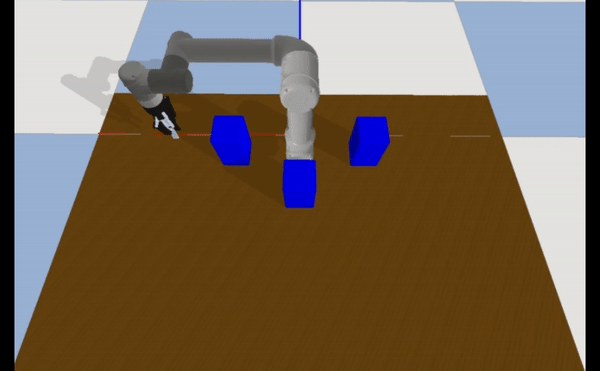

# IPPO
This is part of "Real-time Trajectory Planning with Obstacle Avoidance in Joint Space via Improved Proximal Policy Optimization for Robotic Manipulator"

Replacing inverse kinematics with Improved Proximal Policy Optimization for accomplishing obstacle avoidance in joint space.

  
  
  

